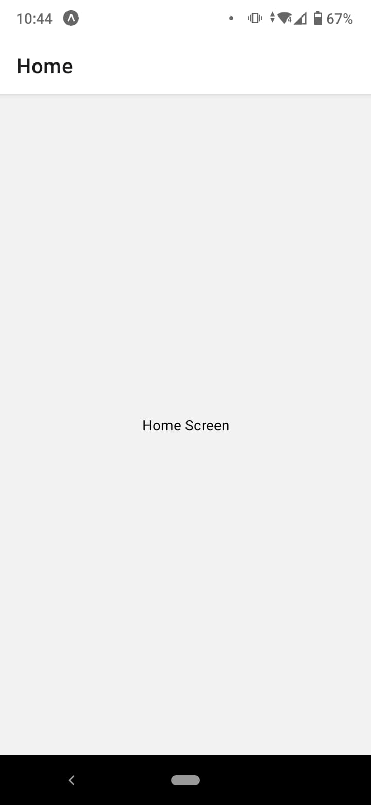
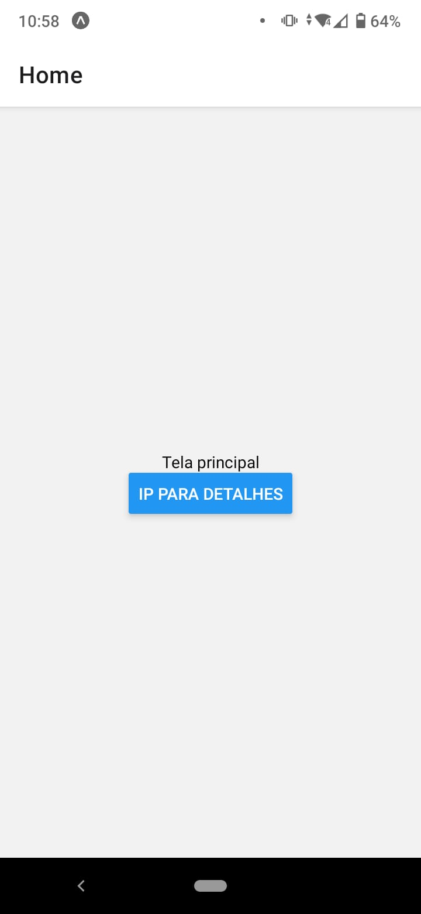
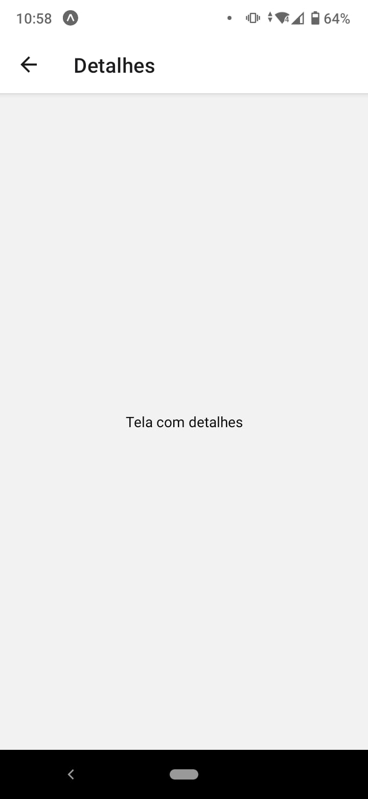

# Stack Navigation

A Stack Navigation é uma navegação que permite que o usuário navegue entre telas de um aplicativo, de forma que ele possa acessar as funcionalidades do aplicativo.


Para utilizar a Stack Navigation, precisamos instalar o pacote `@react-navigation/native-stack`:

```bash
npm install @react-navigation/native-stack
```

## Conceitos básicos

Vamos agora, fazer as alterações necessárias no arquivo `App.js`:

```js
import { Text, View } from 'react-native';
import { NavigationContainer } from '@react-navigation/native';
import { createNativeStackNavigator } from '@react-navigation/native-stack';

function HomeScreen() {
  return (
    <View style={{ flex: 1, alignItems: 'center', justifyContent: 'center' }}>
      <Text>Home Screen</Text>
    </View>
  );
}

const Stack = createNativeStackNavigator();

export default function App() {
  return (
    <NavigationContainer>
      <Stack.Navigator>
        <Stack.Screen name="Home" component={HomeScreen} />
      </Stack.Navigator>
    </NavigationContainer>
  );
}
```

No código acima, temos o seguinte:

* `NavigationContainer`: componente que envolve toda a aplicação, para que ela possa ser renderizada dentro do componente `NavigationContainer`.
* `createNativeStackNavigator`: função que cria um componente `Stack.Navigator`, que é responsável por gerenciar a navegação entre as telas.
* `Stack.Screen`: componente que representa uma tela da aplicação. Ele recebe como propriedades o nome da tela (`name`) e o componente que representa a tela (`component`).

Ainda, temos a definição da função `HomeScreen`, que representa um componente com a tela inicial da aplicação. Esse componente é renderizado dentro do componente `Stack.Screen`.

Ao executar o aplicativo, teremos o seguinte resultado:



## Adicionando uma segunda tela

Vamos agora, adicionar uma segunda tela ao aplicativo. Para isso, vamos criar um componente `DetailsScreen`. Essa alteração pode ser feita no arquivo `App.js`:

```js
function DetailsScreen() {
  return (
    <View style={{ flex: 1, alignItems: 'center', justifyContent: 'center' }}>
      <Text>Details Screen</Text>
    </View>
  );
}
```

Em seguida, vamos adicionar o componente `DetailsScreen` ao componente `Stack.Navigator`, ainda no arquivo `App.js`:

```js
<Stack.Screen name="Details" component={DetailsScreen} />
```

A função App ficará da seguinte forma:

```js
export default function App() {
  return (
    <NavigationContainer>
      <Stack.Navigator initialRouteName="Home" >
        <Stack.Screen name="Home" component={HomeScreen} />
        <Stack.Screen name="Details" component={DetailsScreen} />
      </Stack.Navigator>
    </NavigationContainer>
  );
}
```

Note que, agora, temos duas telas no componente `Stack.Navigator`. Além disso, temos a propriedade `initialRouteName`, que define qual a tela inicial do aplicativo.

Faremos mais uma alteração no componente `HomeScreen`, para que ele possa navegar para a tela `DetailsScreen`. Essa alteração pode ser feita no arquivo `App.js`:

```js
function HomeScreen({ navigation }) {
  return (
    <View style={{ flex: 1, alignItems: 'center', justifyContent: 'center' }}>
      <Text>Home Screen</Text>
      <Button
        title="Go to Details"
        onPress={() => navigation.navigate('Details')}
      />
    </View>
  );
}
```

Ainda é possível informar o título da tela, através da propriedade `options` do componente `Stack.Screen`. Essa alteração pode ser feita no arquivo `App.js`:

```js
<Stack.Screen name="Details" component={DetailsScreen} options={{ title: 'Detalhes' }} />
```

Por fim, o código final do arquivo `App.js` ficará da seguinte forma:

```js
import { Button, Text, View } from 'react-native';
import { NavigationContainer } from '@react-navigation/native';
import { createNativeStackNavigator } from '@react-navigation/native-stack';

function HomeScreen({ navigation }) {
  return (
    <View style={{ flex: 1, alignItems: 'center', justifyContent: 'center' }}>
      <Text>Tela principal</Text>
      <Button
        title="Ip para Detalhes"
        onPress={() => navigation.navigate('Details')}
      />
    </View>
  );
}

function DetailsScreen() {
  return (
    <View style={{ flex: 1, alignItems: 'center', justifyContent: 'center' }}>
      <Text>Tela com detalhes</Text>
    </View>
  );
}

const Stack = createNativeStackNavigator();

export default function App() {
  return (
    <NavigationContainer>
      <Stack.Navigator initialRouteName="Home">
        <Stack.Screen name="Home" component={HomeScreen} />
        <Stack.Screen
          name="Details"
          component={DetailsScreen}
          options={{ title: 'Detalhes' }}
        />
      </Stack.Navigator>
    </NavigationContainer>
  );
}
```

Ao executar o aplicativo, teremos o seguinte resultado:

<span style="display: flex; justify-content: space-between;"><span style="margin-right: 10px"></span> <span></span></span>


<span style="display: flex; justify-content: space-between;"><span>[&lt; Início](. "Voltar")</span> <span>[Em breve &gt;](props.html "Próximo")</span></span>